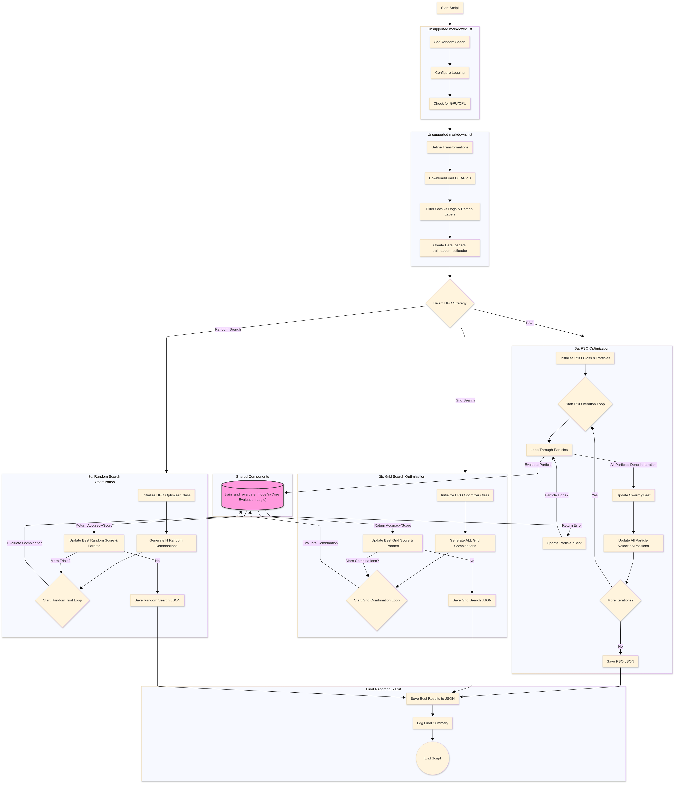

# Report: Hyperparameter Optimization of a CNN for Cat vs. Dog Classification using PSO, Grid Search, and Random Search

## Introduction

Convolutional Neural Networks (CNNs) have demonstrated remarkable success in various computer vision tasks, including image classification. However, the performance of a CNN is highly dependent on the selection of its hyperparameters, such as learning rate, regularization strength (e.g., weight decay), and architectural choices (e.g., dropout rate). Manually tuning these hyperparameters is often a time-consuming and intuition-driven process, lacking systematic exploration and reproducibility. Automated hyperparameter optimization (HPO) techniques provide a more structured approach. This report investigates and compares three HPO methods – Particle Swarm Optimization (PSO), Grid Search, and Random Search – for optimizing key hyperparameters of a CNN designed for a binary image classification task using the PyTorch framework. The objective is to identify the most effective strategy in terms of maximizing classification accuracy on a subset of the CIFAR-10 dataset.

## Problem Statement

The specific problem addressed in this report is the binary classification of images into two categories: 'cat' and 'dog'. This task utilizes a subset of the well-known CIFAR-10 dataset. CIFAR-10 contains 60,000 32x32 color images across 10 classes, presenting a standard benchmark for image classification algorithms. CNNs are particularly well-suited for this problem due to their ability to automatically learn hierarchical spatial features directly from pixel data, effectively capturing patterns relevant for distinguishing between different object classes like cats and dogs. The core challenge lies in finding the optimal configuration for the CNN's hyperparameters – specifically the learning rate, weight decay, and dropout rate – to achieve the highest possible classification accuracy on unseen test data. This report aims to automate this process using PSO, Grid Search, and Random Search and compare their effectiveness.

## Data Acquisition and Pre-processing

The data for this study was sourced from the standard CIFAR-10 dataset, accessed conveniently through the `torchvision.datasets.CIFAR10` module within the PyTorch library. The process involved downloading the dataset if not locally present.

**Workflow (Referencing Mermaid Diagram: "2. Data Handling" subgraph):**

1.  **Loading:** The full CIFAR-10 training and testing datasets were loaded (`C2`).
2.  **Filtering:** As the objective was binary classification, the datasets were filtered to retain only images belonging to the 'cat' (original class index 3) and 'dog' (original class index 5) classes (`C3`). This resulted in 10,000 training images and 2,000 testing images.
3.  **Label Remapping:** A critical preprocessing step involved remapping the original class labels [3, 5] to new, sequential integer labels [0, 1] (`C3`). This was essential because the chosen loss function, `torch.nn.CrossEntropyLoss`, expects target labels to range from 0 to `num_classes - 1`. Failure to remap resulted in runtime errors ("Target out of bounds") during initial development, highlighting the importance of aligning data labels with the model's output layer and loss function requirements. A custom `RemappedDataset` wrapper was implemented to handle this efficiently within the data loading pipeline.
4.  **Transformations:** Standard image transformations were applied (`C1` applied during loading `C2`):
    *   `transforms.ToTensor()`: Converted PIL images to PyTorch tensors.
    *   `transforms.Normalize()`: Standardized pixel values using the commonly accepted means and standard deviations for CIFAR-10 `((0.4914, 0.4822, 0.4465), (0.2023, 0.1994, 0.2010))`. This aids in model convergence.
    *   Data Augmentation (`transforms.RandomCrop`, `transforms.RandomHorizontalFlip`): Applied only to the training set to artificially increase dataset diversity and improve model robustness against variations in object position and orientation.
5.  **DataLoaders:** `torch.utils.data.DataLoader` instances were created (`C4`) for both training and testing subsets. These manage batching (with a batch size of 64), shuffling (for the training set), and parallel data loading using multiple worker processes to accelerate training.

This preprocessing pipeline ensured that the data was appropriately formatted, normalized, and labeled for effective use with the PyTorch CNN model and loss function.

## Traditional Neural Network Implementation (Grid Search & Random Search)

While manual tweaking is a common starting point for hyperparameter selection, it lacks systematic rigor. To establish comparable baselines using automated, non-PSO methods, Grid Search and Random Search were implemented. These strategies fall under the umbrella of 'traditional' automated HPO techniques compared to the bio-inspired PSO.

A dedicated `HyperparameterOptimizer` class was developed to encapsulate the logic for both Grid and Random Search, leveraging the shared `train_and_evaluate_model` function for evaluating each hyperparameter combination. This adheres to OOP principles and promotes code reuse (Referencing Mermaid Diagram: Paths `D --> GRID_FLOW` and `D --> RANDOM_FLOW` converging on `H_EVAL`).

**Search Space:**
Both methods explored the same hyperparameters:
*   `learning_rate`: Controls the step size during gradient descent.
*   `weight_decay`: L2 regularization parameter to prevent overfitting by penalizing large weights.
*   `dropout_rate`: Probability of randomly setting neuron activations to zero during training, also for regularization.

**Grid Search Implementation:**
*   **Strategy:** Exhaustively evaluated every possible combination from predefined discrete sets of hyperparameter values.
*   **Defined Grid (`grid_search_param_space`):**
    *   `learning_rate`: [0.005, 0.001, 0.0005]
    *   `weight_decay`: [1e-05, 0.0001]
    *   `dropout_rate`: [0.3, 0.5]
*   **Total Combinations:** 3 * 2 * 2 = 12 unique combinations were tested.
*   **Evaluation:** Each combination was used to train a fresh `CatDogCNN` instance for 7 epochs (`num_epochs_per_eval`), and the resulting test accuracy was recorded.

**Random Search Implementation:**
*   **Strategy:** Randomly sampled hyperparameter combinations from specified ranges or distributions.
*   **Defined Space (`hyperparameter_config_space`):**
    *   `learning_rate`: Uniformly sampled between 1e-5 and 1e-2 (log-uniform sampling was used internally for better coverage of magnitudes).
    *   `weight_decay`: Uniformly sampled between 1e-6 and 1e-3 (log-uniform sampling used).
    *   `dropout_rate`: Uniformly sampled between 0.1 and 0.6.
*   **Number of Trials:** 30 distinct hyperparameter combinations were randomly sampled and evaluated.
*   **Evaluation:** Similar to Grid Search, each combination was used to train a fresh model instance for 7 epochs, and the test accuracy was recorded.

These methods provide benchmarks against which the performance of the PSO approach can be compared.

## PSO-Optimized Neural Network Implementation

Particle Swarm Optimization (PSO), a population-based stochastic optimization technique inspired by social behaviors like bird flocking, was employed as the primary HPO method for comparison.

**Implementation Details:**
*   **PSO Version:** A standard, non-adaptive version of PSO (as discussed in initial lectures, before adaptive concepts were introduced) was implemented using dedicated `Particle` and `PSO` classes (Referencing Mermaid Diagram: `PSO_FLOW` subgraph).
*   **Swarm Configuration:**
    *   `Swarm Size (num_particles)`: 20 particles were used (`E`). Each particle represents a candidate solution (a specific set of hyperparameters).
    *   `Dimensions`: 3 dimensions, corresponding to the hyperparameters being optimized: `learning_rate`, `weight_decay`, and `dropout_rate`.
    *   `Bounds`: The search space for each dimension was defined by the ranges in `hyperparameter_config_space`:
        *   `learning_rate`: (1e-5, 1e-2)
        *   `weight_decay`: (1e-6, 1e-3)
        *   `dropout_rate`: (0.1, 0.6)
*   **PSO Parameters:** Standard, commonly used values were set:
    *   `Inertia Weight (w)`: 0.7 (balances global and local search).
    *   `Cognitive Coefficient (c1)`: 1.5 (particle's attraction to its own best position).
    *   `Social Coefficient (c2)`: 1.5 (particle's attraction to the swarm's global best position).
*   **Fitness Evaluation:** The fitness of each particle was determined by calling the shared `train_and_evaluate_model` function (`H_EVAL`). This involved:
    1.  Instantiating a new `CatDogCNN` model.
    2.  Training the model for 7 epochs (`num_epochs_per_eval`) using the hyperparameters represented by the particle's current position.
    3.  Calculating the classification error (100 - accuracy) on the test set. PSO aims to *minimize* this error.
*   **Optimization Loop:**
    *   The PSO algorithm ran for 15 iterations (`F`, `G`).
    *   In each iteration, every particle's fitness was evaluated (`H_EVAL`).
    *   Each particle updated its personal best position (`pBest`) if its current position yielded a lower error (`I`).
    *   The global best position (`gBest`) across the entire swarm was updated if any particle found a new lowest error (`J`).
    *   Particle velocities and positions were updated based on inertia, personal best, and global best (`K`).

This implementation systematically searched the hyperparameter space using the swarm intelligence paradigm.
## Diagram



## Performance Comparison and Analysis

The primary goal was to determine which HPO strategy yielded the best hyperparameters, measured by the final test accuracy achieved by a CNN trained with those parameters during the HPO evaluation phase (7 epochs per trial). Execution time provides a secondary comparison metric.

**Results Summary:**

| Optimization Strategy | Best Accuracy (%) | Best Learning Rate | Best Weight Decay | Best Dropout Rate | Approx. Runtime | Total Evaluations |
| :-------------------- | :---------------- | :----------------- | :---------------- | :---------------- | :-------------- | :--------------- |
| Grid Search           | 77.25             | 0.005000           | 0.000010 (1e-5)   | 0.300000          | ~5.4 minutes    | 12               |
| Random Search         | 77.75             | 0.000431           | 0.000005 (4.6e-6) | 0.394633          | ~13.4 minutes   | 30               |
| PSO                   | **78.95**         | 0.004189           | 0.000924 (9.2e-4) | 0.100000          | > 1 hour (est.)*| 300 (20x15)    |

*\*Note: The provided PSO log was incomplete, showing only the start of iteration 6 after ~72 minutes. The final result is based on the best value found up to iteration 4. The estimated total time assumes similar iteration times.*

**Analysis:**

1.  **Accuracy:** Particle Swarm Optimization (PSO) achieved the highest test accuracy (78.95%) among the three methods within the constraints of this experiment, surpassing Random Search (77.75%) and Grid Search (77.25%). This suggests that PSO's guided search mechanism was more effective at navigating the hyperparameter landscape to find a superior combination compared to the exhaustive-but-limited grid or the purely random sampling.
2.  **Hyperparameters:** The optimal parameters found by each method differed significantly:
    *   *Grid Search* favored a relatively high learning rate (0.005), low weight decay (1e-5), and low dropout (0.3).
    *   *Random Search* found a much lower learning rate (0.00043), very low weight decay (~4.6e-6), and moderate dropout (~0.39).
    *   *PSO* settled on a moderate learning rate (0.004), relatively high weight decay (0.0009), and very low dropout (0.1). The higher weight decay found by PSO might indicate it identified a region where stronger regularization was beneficial, perhaps compensating for the low dropout, although more training epochs would be needed to confirm this.
3.  **Computational Cost:**
    *   *Grid Search* was the fastest due to having the fewest evaluations (12). However, its performance is limited by the predefined grid points.
    *   *Random Search* explored more combinations (30) than Grid Search and took longer (~13.4 mins), finding a slightly better result. It offers a good balance between exploration and runtime.
    *   *PSO* performed the most evaluations by far (20 particles * 15 iterations = 300) and consequently took the longest estimated time (> 1 hour). While it found the best result here, its computational cost per discovered improvement needs consideration.

**Conclusion from Comparison:** In this specific experimental setup, PSO demonstrated its potential to outperform Grid Search and Random Search in terms of final accuracy, albeit at a significantly higher computational cost due to the number of required model training evaluations. Random Search provided a good trade-off, achieving accuracy close to Grid Search's best while exploring more diverse parameter combinations within a reasonable time. The distinct hyperparameter sets found highlight that different search strategies explore the landscape differently and may converge to different local optima. The relatively low accuracy differences (~1.7% between best and worst) might also suggest that with only 7 epochs per evaluation, the fitness landscape was noisy, making definitive conclusions challenging without longer evaluation runs or more HPO iterations.

## Discussion and Conclusion

**Discussion:**

This investigation compared three automated hyperparameter optimization techniques – Grid Search, Random Search, and Particle Swarm Optimization (PSO) – for tuning a Convolutional Neural Network performing Cat vs. Dog classification. The results indicate that PSO achieved the highest test accuracy (78.95%) based on evaluations involving 7 training epochs per candidate set, followed by Random Search (77.75%) and Grid Search (77.25%).

A key challenge encountered during implementation was the "Target out of bounds" error, stemming from using original CIFAR-10 labels (3 and 5) with a binary output layer and `CrossEntropyLoss`. This was resolved by implementing a `RemappedDataset` wrapper to ensure target labels were correctly mapped to [0, 1] during data loading, demonstrating the importance of careful data preparation in classification tasks.

While PSO yielded the best accuracy in this limited run, its significantly higher computational cost (due to 300 model evaluations vs. 30 for Random Search and 12 for Grid Search) is a major consideration. Random Search emerged as computationally more efficient than PSO while slightly outperforming the tested Grid Search configuration. The relatively small differences in peak accuracy (~1.7%) might be attributed to the limited number of epochs (7) used for evaluating each hyperparameter set, potentially introducing noise into the fitness landscape and preventing models from fully converging during evaluation. Longer evaluation training would provide a more reliable estimate of hyperparameter quality but would further increase the runtime of all methods, especially PSO.

Furthermore, the standard PSO implemented here uses fixed parameters (`w`, `c1`, `c2`). As discussed in lectures, **Adaptive PSO** techniques could potentially enhance performance and robustness. Methods like using a time-varying inertia weight, applying the constriction factor, or implementing dynamic neighborhood topologies (`lbest`) aim to automatically balance exploration and exploitation during the run. This could lead to faster convergence or finding better optima compared to standard PSO, especially without extensive manual tuning of the PSO parameters themselves. Implementing such adaptive strategies represents a promising direction for future work.

**Conclusion:**

Based on the experiments conducted with a 7-epoch evaluation per trial, Particle Swarm Optimization identified hyperparameters yielding the highest test accuracy (78.95%) for the Cat vs. Dog classification task, outperforming Random Search (77.75%) and Grid Search (77.25%). However, this came at a substantially higher computational cost. Random Search offered a reasonable balance between performance and efficiency. The results highlight the effectiveness of automated HPO methods over manual tuning but also underscore the trade-offs between search strategy complexity, computational budget, and the reliability of fitness evaluations (influenced by epochs per evaluation). For this specific problem setup, PSO showed the most promise for finding high-performing hyperparameters, although its practical application necessitates access to sufficient computational resources (ideally GPUs) and potentially longer run times or the implementation of more advanced adaptive techniques.

**Future Work:**
*   Re-run experiments on a GPU for significantly faster execution.
*   Increase the number of epochs (`num_epochs_per_eval`) used during fitness evaluation (e.g., to 10-15) for more reliable accuracy estimates.
*   Increase the number of PSO iterations and/or Random Search trials to allow for more thorough exploration.
*   Implement and compare an Adaptive PSO variant (e.g., with linearly decreasing inertia weight) against the standard PSO.
*   Expand the hyperparameter search space to include parameters like batch size or optimizer types (e.g., SGD vs AdamW).
*   Train a final model using the best hyperparameters found by the most promising HPO method for a significantly larger number of epochs (e.g., 50+) to determine the true peak performance achievable.

## Running the Program

To execute the hyperparameter optimization script (`cnnCifar10PSOvsGridsearch-v3.py`):

1.  **Setup Environment:** Ensure Python 3.x is installed. It is highly recommended to use a virtual environment:
    ```bash
    python3 -m venv .venv  # Create virtual environment (use python instead of python3 if appropriate)
    source .venv/bin/activate # Activate on Linux/macOS
    # On Windows (Command Prompt): .venv\Scripts\activate.bat
    # On Windows (PowerShell): .venv\Scripts\Activate.ps1
    ```
2.  **Install Requirements:** Install the necessary libraries within the activated environment:
    ```bash
    pip install torch torchvision numpy
    ```
    *(Note: For GPU support, follow official PyTorch instructions for your specific CUDA version).*
3.  **Configure Strategy:** Open the `.py` file in a text editor. Locate the `--- !!! CONFIGURATION SECTION !!! ---` near the start of the `if __name__ == '__main__':` block. Modify the `STRATEGY` variable to select the desired optimization method:
    *   `STRATEGY = 'pso'`
    *   `STRATEGY = 'random'`
    *   `STRATEGY = 'grid'`
    You can also adjust other parameters (`PSO_CONFIG`, `RANDOM_SEARCH_TRIALS`, `grid_search_param_space`, `NUM_EPOCHS_PER_EVAL`, etc.) in this section.
4.  **Run Script:** Execute the script from your terminal while inside the project directory and with the virtual environment activated:
    ```bash
    python cnnCifar10PSOvsGridsearch-v3.py
    ```
    *(Example terminal prompt on macOS after activating venv: `(.venv) username@device assignment-folder % python cnnCifar10PSOvsGridsearch-v3.py`)*
5.  **Check Outputs:** The script will print logs to the console and save detailed logs to `hpo_cnn_optimization.log`. Final results and parameters will be saved to a strategy-specific JSON file (e.g., `pso_search_results.json`).
6.  **GPU Recommended:** Running this script, especially with PSO or a large Grid/Random search, will be significantly faster on a machine with a CUDA-enabled GPU and the appropriate PyTorch installation.

---
