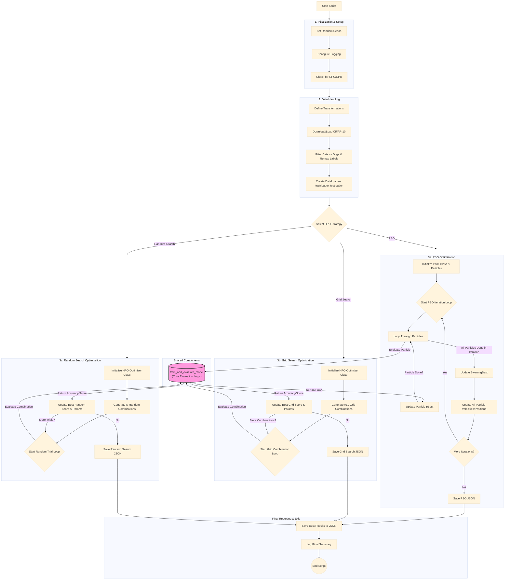

```mermaid
---
config:
  theme: base
---
graph TD
    A[Start Script] --> SETUP;
    SETUP --> DATA;
    DATA --> STRAT_SELECT{Select HPO Strategy};
    STRAT_SELECT -- PSO --> PSO_FLOW;
    STRAT_SELECT -- Grid Search --> GRID_FLOW;
    STRAT_SELECT -- Random Search --> RANDOM_FLOW;
    subgraph SHARED["Shared Components"]
        direction LR
        H_EVAL[("train_and_evaluate_model\n(Core Evaluation Logic)")]:::sharedStyle;
    end
    subgraph REPORTING["Final Reporting & Exit"]
        direction LR
        Z_SAVE_RESULTS[Save Best Results to JSON];
        Z_LOG_SUMMARY[Log Final Summary];
        Z_SAVE_RESULTS --> Z_LOG_SUMMARY;
        Z_LOG_SUMMARY --> Z_END((End Script));
    end
    subgraph SETUP["1. Initialization & Setup"]
        direction TB
        B1[Set Random Seeds];
        B2[Configure Logging];
        B3[Check for GPU/CPU];
        B1 --> B2 --> B3;
    end
    subgraph DATA["2. Data Handling"]
        direction TB
        C1[Define Transformations];
        C2[Download/Load CIFAR-10];
        C3[Filter Cats vs Dogs & Remap Labels];
        C4[Create DataLoaders trainloader, testloader];
        C1 --> C2 --> C3 --> C4;
    end
    subgraph PSO_FLOW["3a. PSO Optimization"]
        direction TB
        E[Initialize PSO Class & Particles];
        E --> F{Start PSO Iteration Loop};
        F --> G[Loop Through Particles];
        G -- Evaluate Particle --> H_EVAL;
        H_EVAL -- Return Error --> I[Update Particle pBest];
        I -- Particle Done? --> G;
        G -- All Particles Done in Iteration --> J[Update Swarm gBest];
        J --> K[Update All Particle Velocities/Positions];
        K --> L{More Iterations?};
        L -- Yes --> F;
        L -- No --> M_SAVE_PSO[Save PSO JSON];
        M_SAVE_PSO --> Z_SAVE_RESULTS;
    end
    subgraph GRID_FLOW["3b. Grid Search Optimization"]
        direction TB
        N[Initialize HPO Optimizer Class];
        N --> O[Generate ALL Grid Combinations];
        O --> P{Start Grid Combination Loop};
        P -- Evaluate Combination --> H_EVAL;
        H_EVAL -- Return Accuracy/Score --> Q[Update Best Grid Score & Params];
        Q -- More Combinations? --> P;
        Q -- No --> R_SAVE_GRID[Save Grid Search JSON];
        R_SAVE_GRID --> Z_SAVE_RESULTS;
    end
    subgraph RANDOM_FLOW["3c. Random Search Optimization"]
        direction TB
        S[Initialize HPO Optimizer Class];
        S --> T[Generate N Random Combinations];
        T --> U{Start Random Trial Loop};
        U -- Evaluate Combination --> H_EVAL;
        H_EVAL -- Return Accuracy/Score --> V[Update Best Random Score & Params];
        V -- More Trials? --> U;
        V -- No --> W_SAVE_RANDOM[Save Random Search JSON];
        W_SAVE_RANDOM --> Z_SAVE_RESULTS;
    end
    classDef sharedStyle fill:#f9d,stroke:#333,stroke-width:2px;

```